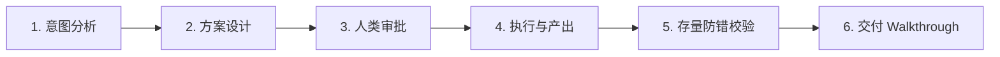

# 03 - 流程文档：先做什么，后做什么 (Processes)

本文件定义了本项目的标准工作流。无论是进行文章撰写、日程管理还是软件开发，AI 助手在执行具体任务时，必须严格遵循本流程，确保交付的高效与安全。

---

## 1. 任务开发与交付标准流程 (Task Flow)

AI 执行任何实质性任务时，均需遵循以下 6 步闭环流程：

1.  **意图分析**：理解人类的核心痛点与真实诉求，分析现有上下文。
2.  **方案设计**：在动工前，提交一份具体实现方案。写明“要改什么”、“如何保证安全”以及“怎么验证它”。
3.  **人类审批**：必须获得人类明确输入“同意”或“继续”后方可进入动工阶段。
4.  **执行与产出**：根据方案进行修改（编写代码、写稿、整理报表），同时保持任务清单 `task.md` 实时打勾。
5.  **存量防错校验**：不仅要检查新做的部分，还要进行**存量防错校验**（例如：对齐之前的发布风格、运行单元测试等），确保新做的事情没有改坏旧的历史成果。
6.  **交付报告生成**：任务完成后，更新 `walkthrough.md` 交付报告，提供可重现的验证步骤或检查证据。

---

## 2. 成果交付与发布流程 (Release Flow)

发布或提交成果前，AI 必须严格执行以下质量关卡：
- **前置清理**：`{{CLEANUP_STEP}}` (例如：运行 workspace 清理命令清除本地临时缓存 / 清理旧的草稿和冗余文字)
- **质量预检**：`{{PRE_CHECK_STEP}}` (例如：进行敏感词和排版格式检测 / 运行编译和打包检查命令)
- **发布执行**：`{{PUBLISH_STEP}}` (例如：将推文上传至排版平台 / 运行发布脚本同步数据)

---

## 3. 紧急撤回与故障恢复流程 (Rollback Flow)

当发布成果出现异常（例如文章排版崩塌、代码报错、日程冲突）时，AI 应指导人类快速按以下步骤执行回退：
1.  **回退恢复**：`{{ROLLBACK_STEP_1}}` (例如：运行 git reset / 在后台将文章撤回或设为私密)
2.  **根因检查**：`{{ROLLBACK_STEP_2}}` (例如：运行本地自查以定位问题)
3.  **重新交付**：`{{ROLLBACK_STEP_3}}`
