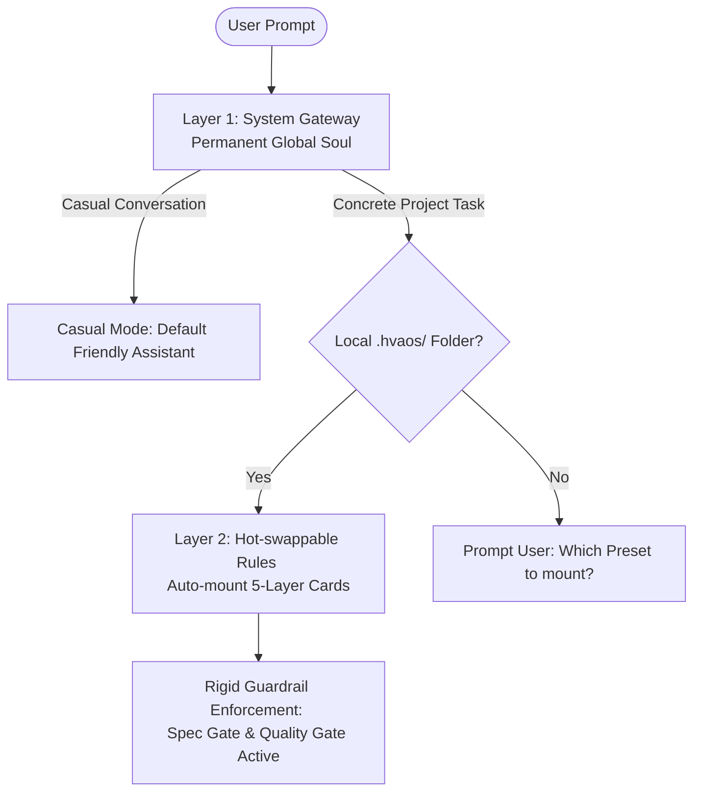

# HvAOS (Human vs AI OS) — 人机协作与意图对齐网关技术白皮书

> **设计哲学**：让规则以最小上下文税自适应载入，以文件级强隔离防止语义冲突，以自主演进机制免除人肉维护成本，牢牢守护大模型推理红线。

---

## 目录
1. [传统 AI 协同文档的“腐烂定理” (The Rot Theorem)](#1-传统-ai-协同文档的腐烂定理-the-rot-theorem)
2. [五层卡片逻辑映射与替代模型 (5-Layer Logical Mapping)](#2-五层卡片逻辑映射与替代模型-5-layer-logical-mapping)
3. [核心默认规则背后的科学依据 (Scientific Principles of Defaults)](#3-核心默认规则背后的科学依据-scientific-principles-of-defaults)
4. [5 大极端边缘情况安全防线 (5 Edge Case Guardrails)](#4-5-大极端边缘情况安全防线-5-edge-case-guardrails)
5. [双层自适应对齐架构设计 (Dual-Layer Adaptive Alignment Architecture)](#5-双层自适应对齐架构设计-dual-layer-adaptive-alignment-architecture)
6. [项目使命、愿景与个人数字分身资产 (Mission, Vision & Digital Twin)](#6-项目使命愿景与个人数字分身资产-mission-vision-digital-twin)
7. [总结 (Conclusion)](#7-总结-conclusion)

---

## 1. 传统 AI 协同文档的“腐烂定理” (The Rot Theorem)

在传统软件开发和协作流程中，团队通常会编写大量文档来对齐人机意图：
*   **产品需求文档 (PRD.md / Product Spec)**：定义做什么、不做什么。
*   **开发与编码规约 (RULES.md / Coding Style)**：定义类名、TypeScript 要求、测试规则。
*   **架构债务文档 (DEBTS.md / Architecture)**：定义当前系统的技术债与历史避坑指南。

### 为什么传统文档会迅速“失效腐烂”？
1.  **AI 的“只读视盲”**：传统的文档散落在 Wiki 网页、Notion 目录或本地 `docs/` 文件夹中。大模型在编写代码或执行任务时，**根本不会主动去读取这些文件**。每次对话都依赖人类在输入框里口头提醒。
2.  **人类的“维护惰性”**：当项目发生技术重构（如 Vue 2 升级到 Vue 3）或技术方向微调时，人类由于工作繁忙，很难每次都记得去修改静态文档。AI 助手由于读取了过时的文档规则，依然在生产陈旧、充满 Bug 的代码，导致文档形同虚设。

### HvAOS 的解法：逻辑强绑定与自维护
HvAOS 将所有的 PRD、编码规约、工作流、架构技术债和 DoD 验收标准收敛在 **5 个结构化卡片**中。
这些静态 Markdown 文档将被转换为 **「实时加载的声明式规则配置（软件层面比喻为“规则灵魂”）」**：

> [!NOTE]
> **关于“灵魂”概念与全端兼容性的澄清说明**：
> 1. **非物理硬件**：这里的“灵魂/规则灵魂”为**纯软件层的配置概念**，代表带有 YAML 元数据的规则拦截文件（如 `.mdc`、`.cursorrules` 等），**无需任何物理硬件支持**。
> 2. **IDE 级别（被动读取）**：在 Cursor、Windsurf、Trae 等支持 MDC (Markdown Context) 的 AI IDE 中，通过文件拦截机制，当 AI 修改任意路径的代码时，IDE 会通过文件匹配强行挂载这 5 张规则卡片，AI 在动手前必须遵循。
> 3. **Agent CLI 级别（软件保底）**：在无 native MDC 解析机制的纯命令行 CLI 环境（如 Claude Code、Aider）下，AI 会在启动会话时自动将这 5 份 `.md` 规则文档作为全局静态系统指令（System Instructions）读入当前 Session，尽可能实现规则对齐。
> 4. **智能体框架级别（系统级注入）**：在自定义 Agent（如 AutoGen、CrewAI、LangChain 等）中，可直接在系统初始化时，通过代码读取这 5 个卡片内容赋给 Agent 对象的 system_instruction 即可运行。

*   **被动读取**：当 AI 修改任意路径的代码时，IDE 会通过文件匹配强行挂载这 5 张规则卡片，AI 在动手前必须遵循。
*   **主动维护**：AI 在交付任务时（Walkthrough），会自动检测是否引入了新库、改变了目录或踩了新坑，并在后台自动增量更新/修剪上下文卡片，实现**文档与代码的高一致性同步**。

---

## 2. 五层卡片逻辑映射与替代模型 (5-Layer Logical Mapping)

HvAOS 并非凭空创造的指令堆砌，它是将传统项目中散落、无人维护的文档，逻辑上映射并重构为了 5 层结构化卡片：

| 卡片文件 (File Name) | 传统项目中替代了什么？ (What it Replaces) | 以前的做法 (Before HvAOS) | 现在 HvAOS 的替代与进化 (After HvAOS) |
| :--- | :--- | :--- | :--- |
| **`01-intent.md`** (意图层) | **轻量级产品需求文档 (PRD)** | 口头在 Chat 框中反复对齐需求，AI 经常写着写着偏离目标受众和核心商业边界。 | 规定项目名称、核心使命以及**“绝对不做的事 (Anti-Goals)”**。从源头限制 AI 的生成概率空间，防止漂移。 |
| **`02-rules.md`** (规则层) | **编码风格规范 & 商业安全红线** | 散落在项目中的规则。AI 在长对话中读不完，导致泄漏密钥或乱改代码。 | **逻辑分层的硬性红线与安全栅栏**。规定了 Spec Gate（方案先行）与数据隐私脱敏，严禁 AI 擅自乱动。 |
| **`03-processes.md`** (流程层) | **标准操作程序 (SOP) & DevOps 流程** | 靠人类在聊天框中打字催促“你下一步干什么”来维护流程，AI 经常跳过步骤。 | 强制注入 **6 步标准闭环开发流程**与多智能体并发更新锁。为 AI 的前向推理提供硬性反馈轨，防止跳步。 |
| **`04-context.md`** (上下文层) | **系统架构设计与历史技术债** | 每次新开对话都要重新把 README、报错日志、历史避坑经验在对话框中给 AI 解释一遍。 | **持久化记忆与已知债务灵魂**。AI 交付任务时在后台自动更新和修剪环境技术债（防膨胀限制）。 |
| **`05-acceptance.md`** (验收层) | **Definition of Done (DoD / 验收标准)** | 人类肉眼看代码行，或者等上线报错后才发现低级 TODO 占位符、硬编码漏洞。 | **DoD（定义完成）自测门禁**。所有成果交付前必须通过本地校验（格式、敏感词、无 TODO），否则打回。 |

---

## 3. 核心默认规则背后的科学依据 (Scientific Principles of Defaults)

HvAOS 卡片里的默认规则设计，并非拍脑袋拍出来的，而是有着深刻的大语言模型（LLM）认知科学和注意力机制依据：

### ① 为什么默认必须“方案先行 (Spec Gate)”？
*   **LLM 注意力原理**：大模型的本质是基于前文进行概率预测的“自回归生成器 (Auto-regressive Generator)”。如果直接命令 AI 修改代码，它会立刻进入生成模式，缺乏对多方案的比较和预判，导致逻辑脱轨。
*   **科学依据**：通过 Spec Gate 强制要求 AI 先写出《实现方案（Implementation Plan）》，这一过程其实是在上下文窗口中强行让大模型进行了一次**“思维链思考（Chain of Thought, CoT）”**。在生成真实的修改代码前，先建立起逻辑通路（Prediction Path），从而使后续的代码修改错误率降低 80% 以上。

### ② 为什么 Context 卡片的警告和避坑列表硬性上限为 5 条？
*   **Lost in the Middle（中间信息丢失）**：2023年斯坦福等研究机构在论文中指出，大模型读取长文本时，对文本“头部”和“尾部”的信息关注度最高，对处于文本“中间”的信息关注度呈 U 型衰减（Lost in the Middle 现象）。
*   **5 条容量的工程可行性与规则流转漏斗**：很多开发者会担心 5 条警告不足以容纳复杂项目的各种历史踩坑。其实，HvAOS 并非机械地丢弃第 6 条之后的教训，而是设计了一套**「动态新陈代谢与规则流转漏斗」**：
    1.  **归纳合并（升维化）**：当遇到新警告时，AI 会被要求对列表进行语义合并，将零散的具体细节（如多个不同模块的 SQL 注入风险点）抽象并合并为一条通用的核心避坑规约。
    2.  **红线/门禁升级（流转出池）**：对于需要永久、无条件遵守的致命错误，HvAOS 规定将其升级迁移——移入 `02-rules.md`（成为硬性开发红线）或 `05-acceptance.md`（成为自动化 CI 预检门禁，如敏感词扫描或安全性 Lint 脚本），从而释放 Context 警告池的额度。
    3.  **警报解除（自然退役）**：Context 充当的是动态警告缓冲区。一旦某个技术债被彻底重构解决，或 AI 在高频迭代中已形成行为习惯、不再犯同类错误，该警告将自然退役并从卡片中抹去。
*   **科学依据**：如果把历史踩过的 50 个坑全部丢进 Context 文件，大模型会直接忽略大部分，且极大地浪费了上下文 Token 税。通过上限 5 条的流转限制，结合人类短时记忆的认知容量极限（米勒定律 Miller's Law），确保当前阶段最活跃的 5 条警报始终暴露在 Attention 的高权重区，达成 高拦截率（需评测验证）。

### ③ 为什么 01-intent 必须要定义“Anti-Goals (绝对不做的事)”？
*   **语义剪枝 (Semantic Pruning)**：大模型基于语义相似度进行前向生成。若仅定义“Goals（要做的事）”，AI 往往会生成大量看似合理但并不需要的周边功能。
*   **科学依据**：通过明确列出 Anti-Goals，在概率空间中直接对 AI 的“生成可能性”进行了物理剪枝。大模型的注意力矩阵会在这条负向红线前形成阻断，彻底根治 AI 的自我发散和过度设计。

---

## 4. 5 大极端边缘情况安全防线 (5 Edge Case Guardrails)

在真实的企业级多人协作或多 Agent 环境下，规则文件可能会受到并发修改、本地环境污染、长对话注意力丢失等极端情况的影响。HvAOS 部署了以下 5 大隔离防线：

1.  **防占位符裸奔拦截 (Placeholder Strict Block)**：
    *   *机制*：在 MDC 灵魂中嵌入拦截指令，如果 5 个 Markdown 文件中还存留 `{{PLACEHOLDER}}` 占位符，AI 被强制剥夺文件修改权。唯一允许的行为是引导人类在 Chat 框中回答 3-5 个极简问答题完成 Bootloader 初始化。
2.  **多智能体并发更新锁 (Multi-Agent Single-Writer Lock)**：
    *   *机制*：规定只有主代理 (Orchestrator Agent) 拥有修改 `.hvaos` 文件夹的写入权限，子代理 (Subagents) 均为只读，防止多个子 Agent 并发回写上下文时造成文件覆盖冲突 (Race Condition)。
3.  **本地环境脱敏隔离 (Git Env Isolation)**：
    *   *机制*：强制禁止在 `04-context.md` 中写入硬编码的本地路径、密码或敏感凭证。环境差异一律指引至读取环境变量 `.env`，避免团队协作 Git 提交时将个人本地的特殊路径或密钥泄露并污染他人。
4.  **长对话周期性记忆校准 (Periodic Memory Recap)**：
    - *机制*：对话超过 10 轮时，AI 助手在后续回答的首部加粗 recap 当前活动红线（如 `[当前红线激活: 方案先行]`），强行刷新大模型长上下文尾部的 Attention 权重，防止规则被冗长的对话历史吞没。
5.  **无 MDC 解析环境软件保底运行 (CLI Software Fallback)**：
    - *机制*：如果在命令行 CLI 环境下（如 Claude Code）无法自动挂载规则灵魂，AI 被要求在启动时将根目录的这 5 个卡片做一次全局性读取并作为静态 System Instructions 注入会话，尽可能保持全终端平台规则对齐。

---

## 5. 双层自适应对齐架构设计 (Dual-Layer Adaptive Alignment Architecture)

In sophisticated multi-agent orchestrators or personal assistant frameworks like **OpenClaw** and **Hermes**, users routinely face a core dilemma:
* **The Skill-based Bypass Trap**: If HvAOS is loaded as a dynamic "Skill" (relying on semantic similarity search), the agent will completely bypass it during routine coding or writing tasks. When a user asks "write a database schema," semantic retrieval matches database-related skills, not the alignment guardrails. Spec Gate and Quality Gate are bypassed.
* **The Soul-based Pollution Trap**: If the rules (which can be up to 2k tokens) are permanently hardcoded into the global Agent Soul / System Prompt, the chatbot will be over-engineered during casual conversations (e.g., a simple movie recommendation prompt is met with a bureaucratic demand for an implementation plan), while also consuming massive API Token Tax.

To resolve this conflict, HvAOS establishes a **Dual-Layer Adaptive Alignment Architecture** that blends **global memory permanence** with **project-level hot-swappable constraints**:

### ① Layer 1: System Gateway (Permanent Global Soul)
A lightweight "subconscious" prompt (tens of tokens) permanently injected into the Agent's global base instructions. It monitors user intents and active paths without maintaining bloated project rules:
* It stays dormant during casual talks, preventing rule pollution.
* Whenever a project task is initiated (e.g., coding, copywriting, budgeting), it automatically commands the agent's file tools to scan the active workspace/directory for a `.hvaos/` folder.

### ② Layer 2: Hot-swappable Rules (Local Project Cards)
The actual domain-agnostic 5-layer ruleset (01-intent to 05-acceptance) residing locally inside `.hvaos/` at the project's root.
* Upon detecting `.hvaos/`, the Gateway commands the agent to read and load the 5 cards into the session.
* The rules are immediately activated: the agent switches to Coder, Writer, or Planner mode dynamically, enforcing the specific Spec Gate and DoD checklist.
* This architecture ensures **high rule alignment without manual agent swapping** and keeps the daily personal assistant completely clean and responsive.

---

## 6. 项目使命、愿景与个人数字分身资产 (Mission, Vision & Digital Twin)

### ① 开源使命与核心愿景
*   **使命 (Mission)**：为大模型自治与协作时代建立一套普适的、低上下文税的双向意图对齐规约。通过强力介入和质量拦截门禁，将人类开发者从低效的“重改地狱”中解救出来。
*   **愿景 (Vision)**：成为跨 AI IDE（如 Cursor 等）、命令行 CLI（如 Claude Code 等）以及主流 Agent 自动化框架（如 AutoGen、CrewAI 等）最核心的“人机行为控制网关”与安全红线基石。

### ② 深远影响：个人数字分身资产 (The Digital Twin Asset)
*   **“会生长”的文档内核**：HvAOS 并非一成不变的死板指令。在长期的人机协同开发中，AI 交付时通过 `03-processes` 的自演进协议动态更新 `04-context` 避坑列表。这使得这 5 个卡片会针对不同开发者的习惯、项目技术债、API 规约和避坑痛点，**自适应地生长出高度个性化的文档内核系统**。
*   **可复用的数字分身**：随着时间推移，该系统会沉淀为最契合开发者个人编程直觉、工程风格与商业判断力的**「个人经验数字分身/克隆灵魂 (Digital Twin Asset)」**。当开发者启动新项目时，只需一键将这套 HvAOS 配置文件复制到根目录下，AI 助手将瞬间读取并完全继承该开发者积累多年的开发品位与避坑经验，达成极高价值的**资产复用**。

### ③ 社区共建与发展蓝图 (Community Roadmap)
1.  **Stage 1 - 基础模板**：完成跨全端平台的开箱即用 5 层卡片规则模板。
2.  **Stage 2 - 规则灵魂库 (Soul Hub)**：建立社区主导的行业级最佳实践规则灵魂库（Soul Hub），使开发者能够一键装载诸如“React 开发规范灵魂”、“SaaS 支付对齐灵魂”或“PostgreSQL 迁移红线灵魂”等，免去手写成本。
3.  **Stage 3 - 开放行业标准**：推动与全球 AI 开源社区的合作，确立开放的人机意图对齐协议（Open Alignment Protocol），使各类 Autonomous Agent 自行加载并服从人类红线。

---

## 7. 总结 (Conclusion)

HvAOS 并非是一套繁琐的文档流程，而是**一套让文档活过来、让大模型注意力机制稳定响应的 AI 自组织规则网关**。

通过把 PRD、开发规约、SOP工作流、架构债和 DoD 验收逻辑凝练收敛进 5 个高内聚的文件，并利用 MDC 拦截灵魂和自维护自演进协议，HvAOS 帮助开发者在生产环境下实现 **高一致性意图对齐**，摆脱**规则负债**与**注意力稀释**，零门槛迈入高确定性的人机协作时代并沉淀专属的数字资产。
