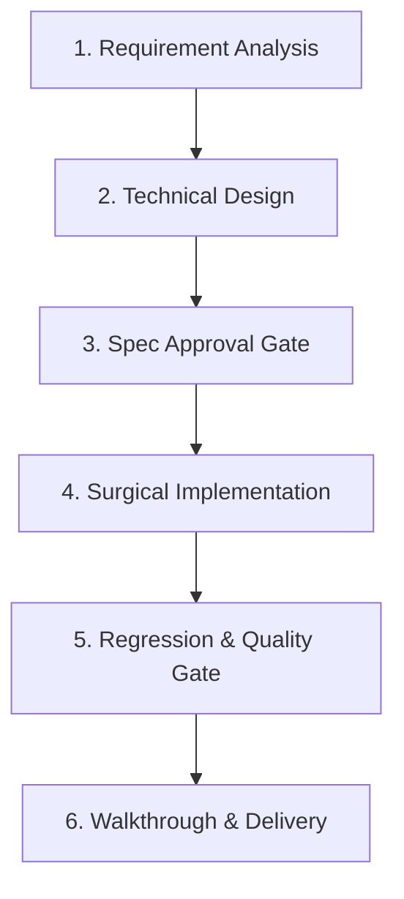

# 03 - Processes Document (Workflows & Pipelines)

This document defines the standard workflows for coding tasks. The AI assistant must strictly follow these step-by-step processes to ensure repeatable, reliable, and high-quality deliveries.

---

## 1. Task Development Pipeline (6-Step Cycle)

1.  **Requirement Analysis**: Carefully parse user requirements, inspect open files, and query relevant symbols in the codebase to understand the context.
2.  **Technical Design**: Before changing any files, draft an implementation plan detailing the modified files, dependency additions, test plans, and potential side-effects.
3.  **Spec Approval Gate**: Present the plan to the user. Stop execution and wait for the user to explicitly approve or provide feedback.
4.  **Surgical Implementation**: Perform the minimal necessary code changes while keeping a detailed `task.md` checklist updated.
5.  **Regression & Quality Gate**: Verify modifications against existing code. Run build commands, linter checks, and test suites. Ensure no previous functionality is broken.
6.  **Walkthrough & Delivery**: Document the exact changes, the tests run, and the outcomes. Provide a clean `walkthrough.md` file including execution logs or visual evidence of the result.

---

## 2. Release & Deployment Pipeline

Before releasing a build or merging a pull request to the production branch, execute the following gate check:
*   **Workspace Cleanup**: Run clean scripts to delete temporary files, mock logs, build caches, and local configuration overrides (e.g., `npm run clean` or removing temp build artifacts).
*   **Pre-flight Verification**: Run the full compilation checks and test suite (`npm run lint && npm run test && npm run build`) to ensure the build compiles successfully.
*   **Automated Deployment**: Execute the authorized deployment script (e.g., deploying to staging/production via `wrangler pages deploy` or CI pipeline triggers).

---

## 3. Rollback & Recovery Plan

When a deployment fails or a production incident is detected, follow these steps in rapid sequence:
1.  **Immediate Reversion**: Revert the main branch to the last known stable commit (e.g., `git revert` or restoring Cloudflare Pages deployment to the previous successful build).
2.  **Local Reproduction**: Check logs to isolate the root cause. Set up a local test environment to reproduce the bug without modifying production.
3.  **Redeliver with Fix**: Submit a new patch with a regression test case added to the suite to prevent future occurrences.
