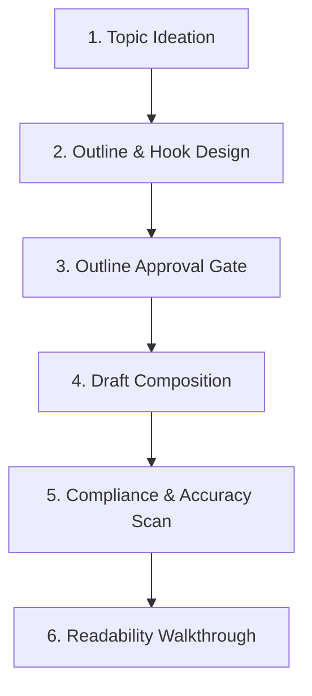

# 03 - Processes Document (Workflows & Pipelines)

This document outlines the standard content generation lifecycle. The AI assistant must follow these processes sequentially to ensure content is optimized for reader retention and compliance.

---

## 1. Content Creation Lifecycle (6-Step Cycle)

1.  **Topic Ideation**: Identify high-traffic, high-relevance developer topics based on current trends or human direction.
2.  **Outline & Hook Design**: Draft a structure outline defining the Hook (first 3 sentences), the Body (key sections), and the Call to Action (CTA).
3.  **Outline Approval Gate**: Present the outline to the human. Do NOT start writing the full text until the human responds with approval.
4.  **Draft Composition**: Write the full draft based on approved outlines, maintaining strict scannability guidelines and brand tone.
5.  **Compliance & Accuracy Scan**: Conduct a static check for banned keywords, verify that code examples are correct, and cross-reference quotes.
6.  **Readability Walkthrough**: Present the draft, highlighting where the main hooks are, the total word count, and suggestions for visual assets or code styling.

---

## 2. Release & Distribution Process

Before posting the article live on platforms (e.g., WeChat, Medium, Dev.to):
*   **Final Visual Polish**: Export code blocks into high-contrast image snippets or markdown cards. Remove any temporary markdown formatting that doesn't render properly on target platforms.
*   **Metadata Preparation**: Draft a 120-character SEO description and select 3-5 highly relevant tags/keywords.
*   **Cross-platform Publishing**: Upload to target platforms using templates that respect local formatting rules (such as WeChat's custom CSS templates or Medium's editor styles).

---

## 3. Post-Publishing Rollback & Hotfix Plan

If an article is published with errors (e.g., a broken link, a critical code bug, or platform compliance warnings):
1.  **Immediate Soft Rollback**: Update the post immediately if the platform permits live edits. If it's a major compliance issue, pull the article to "Draft/Private" mode.
2.  **Correction Logging**: Pin a comment clarifying the correction (e.g., "Fix in line 12 of the code sample") to minimize confusion.
3.  **Post-mortem Update**: Update the reference documentation and local knowledge base to ensure the error is not repeated in future drafts.
